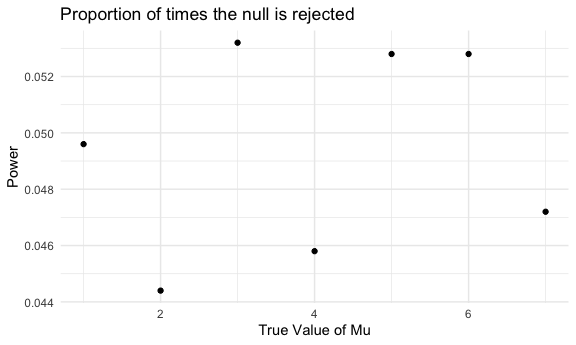

P8105\_HW5\_jlh2270
================
Juyoung Hahm
11/17/2020

## Problem 1

Read in the data. Create a city\_state variable (e.g. “Baltimore, MD”)
and then summarize within cities to obtain the total number of homicides
and the number of unsolved homicides (those for which the disposition is
“Closed without arrest” or “Open/No arrest”).

``` r
homicide_df = 
  read_csv("homicide-data.csv") %>% 
  mutate(
    city_state = str_c(city, state, sep = "_"),
    resolved = case_when(
      disposition == "Closed without arrest" ~ "unsolved",
      disposition == "Open/No arrest"        ~ "unsolved",
      disposition == "Closed by arrest"      ~ "solved",
    )
  ) %>% 
  select(city_state, resolved) %>% 
  filter(city_state != "Tulsa_AL")
```

Let’s look at this a bit

``` r
aggregate_df = 
  homicide_df %>% 
  group_by(city_state) %>% 
  summarize(
    hom_total = n(),
    hom_unsolved = sum(resolved == "unsolved")
  )
```

For the city of Baltimore, MD, use the prop.test function to estimate
the proportion of homicides that are unsolved; save the output of
prop.test as an R object, apply the broom::tidy to this object and pull
the estimated proportion and confidence intervals from the resulting
tidy dataframe.

``` r
prop.test(
  aggregate_df %>% filter(city_state == "Baltimore_MD") %>% pull(hom_unsolved), 
  aggregate_df %>% filter(city_state == "Baltimore_MD") %>% pull(hom_total)) %>% 
  broom::tidy()
```

    ## # A tibble: 1 x 8
    ##   estimate statistic  p.value parameter conf.low conf.high method    alternative
    ##      <dbl>     <dbl>    <dbl>     <int>    <dbl>     <dbl> <chr>     <chr>      
    ## 1    0.646      239. 6.46e-54         1    0.628     0.663 1-sample… two.sided

Try to iterate ……..

``` r
results_df = 
  aggregate_df %>% 
  mutate(
    prop_tests = map2(.x = hom_unsolved, .y = hom_total, ~prop.test(x = .x, n = .y)),
    tidy_tests = map(.x = prop_tests, ~broom::tidy(.x))
  ) %>% 
  select(-prop_tests) %>% 
  unnest(tidy_tests) %>% 
  select(city_state, estimate, conf.low, conf.high)
```

Create a plot that shows the estimates and CIs for each city

``` r
results_df %>% 
  mutate(city_state = fct_reorder(city_state, estimate)) %>% 
  ggplot(aes(x = city_state, y = estimate)) +
  geom_point() + 
  geom_errorbar(aes(ymin = conf.low, ymax = conf.high)) + 
  theme(axis.text.x = element_text(angle = 90, vjust = 0.5, hjust = 1))
```


``` r
homicide_df = 
  read_csv("homicide-data.csv") %>% 
  mutate(
    city_state = str_c(city, state, sep = "_"),
    resolved = case_when(
      disposition == "Closed without arrest" ~ "unsolved",
      disposition == "Open/No arrest"        ~ "unsolved",
      disposition == "Closed by arrest"      ~ "solved",
    )
  ) %>% 
  select(city_state, resolved) %>% 
  filter(city_state != "Tulsa_AL") %>% 
  nest(data = resolved)
```

# Problem 2

``` r
path = list.files(pattern = "*.csv") %>%
  map_df(~read_csv(.)) %>%
  select(starts_with("week")) %>%
  slice(1:20)

path$arm = c("control","control","control","control","control","control","control","control","control","control","experimental","experimental","experimental","experimental","experimental","experimental","experimental","experimental","experimental","experimental")
path$ID = c(1,2,3,4,5,6,7,8,9,10,1,2,3,4,5,6,7,8,9,10)
path %>%
  select(arm, ID, everything())
```

    ## # A tibble: 20 x 10
    ##    arm             ID week_1 week_2 week_3 week_4 week_5 week_6 week_7 week_8
    ##    <chr>        <dbl>  <dbl>  <dbl>  <dbl>  <dbl>  <dbl>  <dbl>  <dbl>  <dbl>
    ##  1 control          1   0.2  -1.31    0.66   1.96   0.23   1.09   0.05   1.94
    ##  2 control          2   1.13 -0.88    1.07   0.17  -0.83  -0.31   1.58   0.44
    ##  3 control          3   1.77  3.11    2.22   3.26   3.31   0.89   1.88   1.01
    ##  4 control          4   1.04  3.66    1.22   2.33   1.47   2.7    1.87   1.66
    ##  5 control          5   0.47 -0.580  -0.09  -1.37  -0.32  -2.17   0.45   0.48
    ##  6 control          6   2.37  2.5     1.59  -0.16   2.08   3.07   0.78   2.35
    ##  7 control          7   0.03  1.21    1.13   0.64   0.49  -0.12  -0.07   0.46
    ##  8 control          8  -0.08  1.42    0.09   0.36   1.18  -1.16   0.33  -0.44
    ##  9 control          9   0.08  1.24    1.44   0.41   0.95   2.75   0.3    0.03
    ## 10 control         10   2.14  1.15    2.52   3.44   4.26   0.97   2.73  -0.53
    ## 11 experimental     1   3.05  3.67    4.84   5.8    6.33   5.46   6.38   5.91
    ## 12 experimental     2  -0.84  2.63    1.64   2.58   1.24   2.32   3.11   3.78
    ## 13 experimental     3   2.15  2.08    1.82   2.84   3.36   3.61   3.37   3.74
    ## 14 experimental     4  -0.62  2.54    3.78   2.73   4.49   5.82   6      6.49
    ## 15 experimental     5   0.7   3.33    5.34   5.57   6.9    6.66   6.24   6.95
    ## 16 experimental     6   3.73  4.08    5.4    6.41   4.87   6.09   7.66   5.83
    ## 17 experimental     7   1.18  2.35    1.23   1.17   2.02   1.61   3.13   4.88
    ## 18 experimental     8   1.37  1.43    1.84   3.6    3.8    4.72   4.68   5.7 
    ## 19 experimental     9  -0.4   1.08    2.66   2.7    2.8    2.64   3.51   3.27
    ## 20 experimental    10   1.09  2.8     2.8    4.3    2.25   6.57   6.09   4.64

# Problem 3

## Conduct a simulation to explore power in a one-sample t-test.

``` r
ttest_sim = function(n, mu = 0, sigma = 5) {
  data_sim = tibble(
    x = rnorm(n = 30, mean = mu, sd = sigma),
  )
    ttest=t.test(data_sim, mu=0, sd=5)
    ttest[['p.value']]
    ttest[['estimate']]
    
  results_sim = tibble(
     pvalue = ttest[['p.value']],
     mean = ttest[['estimate']]
  )
}
```

## Generate 5000 datasets from the model

``` r
output = vector("list", 5000)

for (i in 1:5000) {
  output[[i]] = ttest_sim(30)
}

sim_results = bind_rows(output)
sim_results
```

    ## # A tibble: 5,000 x 2
    ##    pvalue   mean
    ##     <dbl>  <dbl>
    ##  1 0.629   0.412
    ##  2 0.368   0.664
    ##  3 0.534   0.551
    ##  4 0.487   0.567
    ##  5 0.0599 -1.65 
    ##  6 0.229   1.19 
    ##  7 0.738   0.334
    ##  8 0.209  -1.19 
    ##  9 0.887   0.122
    ## 10 0.472   0.684
    ## # … with 4,990 more rows

## Repeat for mu={1,2,3,4,5,6,7}

``` r
mu_list =
  list(
    "mu_1" = 1,
    "mu_2" = 2,
    "mu_3" = 3,
    "mu_4" = 4,
    "mu_5" = 5,
    "mu_6" = 6,
    "mu_7" = 7
  )

output = vector("list", length = 7)

for (i in 1:7) {
  output[[i]] = rerun(5000, ttest_sim(mu_list[[i]])) %>% 
    bind_rows

}


graph_data =
bind_rows(output) %>%
mutate(
test_results = case_when(
  pvalue < .05 ~ "reject",
  pvalue >= .05 ~ "fail to reject"
))

a = slice(graph_data, 1:5000)
a$mu = rep(1,nrow(a))

b = slice(graph_data, 5001:10000)
b$mu = rep(2,nrow(b))

c = slice(graph_data, 10001:15000)
c$mu = rep(3,nrow(c))

d = slice(graph_data, 15001:20000)
d$mu = rep(4,nrow(d))

e = slice(graph_data, 20001:25000)
e$mu = rep(5,nrow(e))

f = slice(graph_data, 25001:30000)
f$mu = rep(6,nrow(f))

g = slice(graph_data, 30001:35000)
g$mu = rep(7,nrow(g))

graph_data = do.call("rbind", list(a,b,c,d,e,f,g))
```

## Make a plot showing the proportion of times the null was rejected (the power of the test) on the y axis and the true value of μ on the x axis. Describe the association between effect size and power.

``` r
graph_data %>% 
  group_by(mu) %>%
  mutate(
    reject = ifelse(pvalue < '0.05', 1, 0)
       ) %>% 
  summarize(prop_reject = mean(reject)) %>% 
  ggplot(aes(x = mu, y = prop_reject)) +
  geom_point() +
  labs(
    title = "Proportion of times the null is rejected",
    x = "True Value of Mu",
    y = "Power")
```

    ## `summarise()` ungrouping output (override with `.groups` argument)


When the effect size increases, the power increases.

## Make a plot showing the average estimate of μ̂ on the y axis and the true value of μ on the x axis.

``` r
mu_hat = list( mean(a$mean), mean(b$mean), mean(c$mean), mean(d$mean), mean(e$mean), mean(f$mean),mean(g$mean))
true_mu = list(1,2,3,4,5,6,7)
```

``` r
plot(x = true_mu, y = mu_hat)
```


  - Make a second plot (or overlay on the first) the average estimate of
    μ̂ only in samples for which the null was rejected on the y axis and
    the true value of μ on the x axis.

<!-- end list -->

``` r
a_reject = 
  a %>%
  filter(
    test_results == "reject"
  ) 
a_reject_average = mean(a_reject$mean)

b_reject = 
  b %>%
  filter(
    test_results == "reject"
  ) 
b_reject_average = mean(b_reject$mean)

c_reject = 
  c %>%
  filter(
    test_results == "reject"
  ) 
c_reject_average = mean(c_reject$mean)

d_reject = 
  d %>%
  filter(
    test_results == "reject"
  ) 
d_reject_average = mean(d_reject$mean)

e_reject = 
  e %>%
  filter(
    test_results == "reject"
  ) 
e_reject_average = mean(e_reject$mean)

f_reject = 
  f %>%
  filter(
    test_results == "reject"
  ) 
f_reject_average = mean(f_reject$mean)

g_reject = 
  g %>%
  filter(
    test_results == "reject"
  ) 
g_reject_average = mean(g_reject$mean)

mu_hat_reject = list(a_reject_average, b_reject_average, c_reject_average, d_reject_average, e_reject_average, f_reject_average, g_reject_average)
```

  - Is the sample average of μ̂ across tests for which the null is
    rejected approximately equal to the true value of μ? Why or why not?

<!-- end list -->

``` r
plot(x = true_mu, y = mu_hat_reject)
```

 It
definitely got closer to the true mean when we only calculated rejected.
Because if we rejected null, then it means that the mean could be bigger
or less than the true mean.
